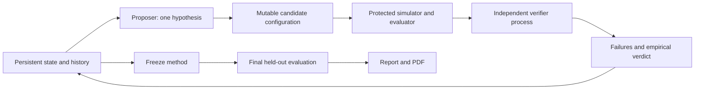

# RobustLoc-Agent

## Theory-driven v2（当前研究路线）

当前阶段为 [Phase 2：全局鲁棒稳定性](v2/global_stability/README.md)，核心对象
为 μ_q(D)。已运行 [global-stability-001](v2/runs/global-stability-001/report.md)：
全局误差界、local/global 条件、精确反例、有理数证书及 conditional q profile。
新颖性未确立。Phase 1 和 v1 都保持历史字节与来源哈希。

`run-001` 已于 2026-09-30 永久冻结，不再优化其 CEP90；旧报告仅作为历史记录。
当前工作见 [v2](v2/README.md)：先审计 frame/FIM/erasure 文献，再研究至多 q 个
任意污染下的几何可辨识性、书面证明、非线性反例与条件稳定恢复。
所有 v2 主张标为 known / proved-in-project / conjectured /
numerically-supported / refuted，不将已知 frame/FIM 结果作为新发现。

---

以下内容为 v1 课程工程与历史实验说明。

面向众包 BLE 距离代理观测的鲁棒非线性定位科研 Agent，AI for Math 课程项目。
研究问题：在固定异方差、离群点和几何退化仿真下，持续研究闭环能否降低 WLS 的
CEP90 与超过 10 米的失败率？结果限定于本项目 synthetic benchmark。

这是持久化、反馈驱动的规则型 Agent：读取历史 -> 提出一个数学假设 -> 修改候选
配置 -> 执行代码/实验 -> 独立验证进程可拒绝 -> 保存反例 -> 选择下一步。
候选机制预定义，不能声称开放式数学创新或调用了 LLM。项目 Skills 供 Codex
辅助扩展，Python 控制器不执行 Markdown。参考思想来自
[Creative-Intelligence](https://github.com/DeepMathLLM/Creative-Intelligence)，未复制代码。



## Quick start

Python 3.10+，在本目录运行：

```powershell
python -m venv .venv
.\.venv\Scripts\python.exe -m pip install -r requirements.txt
.\.venv\Scripts\python.exe -m pytest -q
.\.venv\Scripts\python.exe agent.py baseline --run runs/reproduce
.\.venv\Scripts\python.exe agent.py research --run runs/reproduce --iterations 8
.\.venv\Scripts\python.exe agent.py finalize --run runs/reproduce
```

Linux/macOS 改用 `.venv/bin/python`。已有 run 不覆盖 baseline；research 重复执行
会恢复状态。`--iterations 1` 可逐轮运行。冻结后拒绝继续研究。报告生成于 report/
（重现运行会更新报告，原始实验 JSON 仍保留）。依赖精确版本见 environment.lock.txt。

## Math and evaluation

Residual: r_i(x)=||x-p_i||-d_i. NLS: sum r_i². WLS: sum c_i*r_i²/s_i²,
s_i²=σ_distance²+σ_position². 候选研究 Huber/Cauchy/soft-L1、MAD 尺度、权重
与多起点。位置误差方差加法是一阶近似；没有全局最优保证。

固定 8 场景，development 100、validation 150、held-out 250 cases/scenario。
种子根 110000/220000/930000，scenario offset 10000；三组隔离。Failure Rate
严格定义为 error >10 m。报告均值、中位数/CEP50、CEP90、失败率、runtime、
优化失败及非有限值。优化失败使用有标记的 centroid fallback，保留误差。
Confidence 非异常标签；RSSI 是加性距离噪声近似。移动目标尚未实现。

保护代码与 baseline 结果通过 SHA256 检查。保护是审计约束，非恶意代码沙箱。
接受规则在 config.toml 预先固定；验证集重复选择可能过拟合；最终一次冻结后
运行 held-out。Bootstrap 是固定已选方法的条件置信区间，不校正整个选择过程。

## Results and artifacts

本次已运行 8 轮：4 次接受、4 次拒绝；11 项 pytest 通过。最终 2,000 个 held-out
案例，WLS → final：CEP90 **18.652 → 6.344 m**（下降 **66.0%**），Failure Rate
**25.70% → 5.25%**。无异常场景的 CEP90 略有退化；稀疏场景仍有 **26.8%** 失败。
最终方法：Cauchy loss + observation-only MAD scale，保留异方差尺度、取消随机
confidence weighting，单起点。验证集最优为第 6 轮，最终评价之后未调参。

真实运行摘要见 [RESULTS.md](RESULTS.md)，报告见 [report/report.md](report/report.md)
和 [report/report.pdf](report/report.pdf)。每轮日志包括拒绝结果，完整逐 case 输出
和反例位于 runs/run-001/iterations/。不证明数学定理、不证明新颖性、不证明工业适用性。

## Repository structure

```text
agent.py                 baseline / research / finalize controller
config.toml              fixed research and acceptance budget
robustloc/               simulator, solvers, evaluator, proposer, verifier, storage
.agents/skills/          proposer and verification project Skills
tests/                   executable pytest checks
experiments/             convenient benchmark entrypoints
runs/run-001/            baseline, 8 rounds, raw cases, state, hashes, figures
report/                  evidence-bound Markdown and PDF
PROJECT_SPEC.md           frozen mathematical and experimental contract
```

## GitHub publication

代码和结果可直接入库；不要提交虚拟环境或密钥。需要本人 GitHub 登录及仓库地址。
在仓库根目录配置 remote 后使用 `git push -u origin main`。本地交付不等于上传成功。
