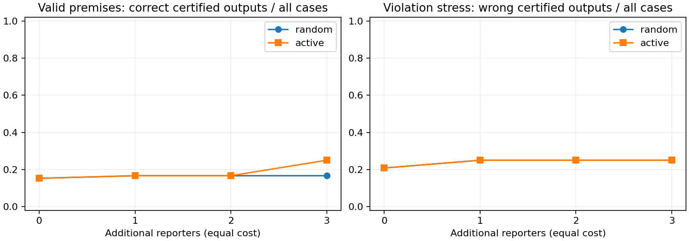

# 原题闭环验收结论

日期：2026-10-10。实验前基线：`0c78d9f`。本次只新增 `final_acceptance/`。

**结论：合成定位闭环及其条件证书通过本次工程核验；当前结果不足以把系统交付为“已解决众包离线高精度定位”的方案。** 最明显的应用限制是认证覆盖率低，以及真实前提失效时可能错误认证。不能只用“零错误输出”作为成功标准。

## 原题与项目之间的对应

老师题目名称与背景来自用户提供的“众包离线高精度定位 / HarmonyOS 难题发布第七期”。本次未取得可独立核对的原始教师文件，公开标题检索也未确认一手原文。因此不能把本项目设定的 0.5 m 阈值、二维区域或预算当作老师指定的指标。

| 原题困难 | 本次实际处理 | 仍未验证 |
|---|---|---|
| BLE/RSSI 距离不准 | 有界异方差距离代理噪声、WLS 与 Cauchy 对照 | 真实 RSSI→距离标定、多径、遮挡、设备差异 |
| reporter 位置不准 | nominal/actual anchors 分离，公开位置误差球，复用 v3b 条件界 | GNSS/WiFi 误差球的可靠取得、尾部误差 |
| reporter 分布不均 | 每例随机布局；分散、簇集、共线、稀疏分别保留 | 真实设备密度与可用性分布 |
| 异常观测 | 全局 Q 覆盖旧与候选 reporter，异常身份预先固定 | 现实中 Q 的可信取得，未知 Q 的认证恢复 |
| 信息不足 | recover / abstain，公开几何选取新 reporter，再接收固定响应并重认证 | 实际采集协议、时延、电量、移动目标 |
| Agent 的贡献 | 确定性定位决策闭环；v5 的 Codex 自主科研单独留档 | 此处没有重新验证 LLM 对定位性能的增益 |

## 最终运行与复核

预注册了 10 类场景 × 12 个实例，共 120 个新的 paired episodes，其中有效契约 72 个、假设失效压力案例 48 个。每例比较随机/主动两种顺序，新增 k=0..3 个 reporter，每个数据集比较 WLS、Cauchy 与认证输出。k=0 共享初始数据，2,880 行输出记录不是 2,880 个独立样本。

- [最终运行报告](final-001/REPORT.md)、[场景统计](final-001/summary.csv)、[全部逐输出记录](final-001/results.csv)。
- [重放审计](final-001/audit.json)：120 个案例、960 个检查点、2,880 次求解重放一致；194 次恢复证书被重新消费。194 包含假设失效场景的条件证书，不能称为 194 次真实可靠定位。
- 所有有效契约案例中，没有观察到认证输出违反报告误差界；所有声明前提、响应绑定与动作成本都已重算。
- 开发运行使用独立种子，最终运行前不改方法和阈值；最终结果出来后未调参或补选更有利场景。

## 有什么实际收益，收益有多大？

在 72 个有效契约案例中，新增 3 个 reporter 后：

| 策略与输出方法 | 输出数 | 超过 0.5 m 的输出 | 正确输出/全部案例 |
|---|---:|---:|---:|
| 随机采集 + WLS | 72 | 35 | 37/72 |
| 主动采集 + WLS | 72 | 42 | 30/72 |
| 随机采集 + Cauchy | 72 | 0 | 72/72 |
| 主动采集 + Cauchy | 72 | 0 | 72/72 |
| 随机采集 + 条件认证 | 12 | 0 | 12/72 |
| 主动采集 + 条件认证 | 18 | 0 | 18/72 |

**numerically-supported：** 同样新增 3 个设备，主动采集让正确认证输出增加 6 个，即 8.33 个百分点；分场景配对 bootstrap 描述性 95% 区间为 [2.78, 13.89] 个百分点。增量来自共线场景 2 例、稀疏场景 4 例。预算 0、1、2 时该指标没有优势。区间未校正多重比较，样本也不代表部署总体。

**没有支持：** 认证系统整体定位效果优于 Cauchy。事实上，随机或主动新增 1 个 reporter 后，本次 Cauchy 就已经在所有 72 个有效契约案例中低于 0.5 m 阈值。主动认证在 k=3 时仍拒绝了 54/72=75% 的案例。认证输出具有条件保证，但其低覆盖率不能通过只报告输出子集的低误差掩盖。

主动几何选择也没有普遍帮助其他估计器：同预算 WLS 在主动路径上出现了更多错误输出。这与所优化的是保守证书质量而非每个估计器的实际误差一致；本实验并未证明两者之间的因果机制。

## 什么条件下仍会给出错误答案？

**numerically-supported：** 在“位置误差球被低报”的 12 个压力案例中，新增 3 个 reporter 后，两种策略都输出了 12 个超过 0.5 m 的位置，并违反其报告误差界。仿真中的实际 anchor 整体偏移 0.6 m，而公开误差半径只有 0.02 m。这个条件不成立，验证器无法仅从残差和名义几何证明它真实。

其他三类压力场景在 k=3 时均未获得认证输出；这不建立对所有假设失效的检测保证。全部压力案例与有效契约主结果分开保存。

这与先前 v3b 的信任边界一致：**条件数学证明成立，不代表真实物理前提已经被系统验证。** 不能把它包装为“Agent 知道所有时候都能否定位”。

## 是否可以收束？

| 判断 | 本次结论 |
|---|---|
| 是否有可执行的定位—拒绝—获取观测—再认证闭环？ | 已运行并完整重放 |
| 是否保留原题相关的公平对照与失败？ | 已保留，含强于认证方法的 Cauchy 结果 |
| 数学证书在本次有效前提下是否观察到失效？ | 未观察到；不等于软件正确性的形式证明 |
| 主动策略是否全面优于随机采集？ | 否；只有 k=3 的正确认证输出指标有本轮支持 |
| 是否已经达到真实 HarmonyOS 高精度定位验收？ | unresolved；缺少原始数值要求及真实设备验证 |

因此，可以把项目收束为**有明确失败边界的课程研究原型**来组织报告；不应宣称完成原题工业解法。若继续研究，证据指向的是同一定位问题下的覆盖率与可信误差契约，或真实数据验收，而不是再扩一个逆问题。任何后续改进都必须另开实验与未用过的评估数据，不能回头调本次最终集。

## 测试与冻结说明

新增 9 项契约/统计测试通过：[记录](new-contract-tests.xml)。旧定位模块的完整 44 项回归在 `c734a70` 独立工作树通过：[记录](frozen-regression-tests.xml)。临时工作树已在确认干净后移除。

首次在当前首页版本运行组合测试得到 51 passed / 2 failed：[原日志](acceptance-tests.xml)。两项失败是旧版本的 README 哈希检查，与此前首页更新已声明的冻结差异一致；它们没有被删除、跳过或修改为通过。随后在正确历史快照上完整复核。当前验收绑定 `0c78d9f` 时的 4,483 个文件，全部字节保持不变。

本次没有重新运行 v5 模型调用，没有改变历史数学账本，没有生成新的原创性声明。定位实验结论统一为 numerically-supported，真实部署与原题工业验收仍 unresolved。
