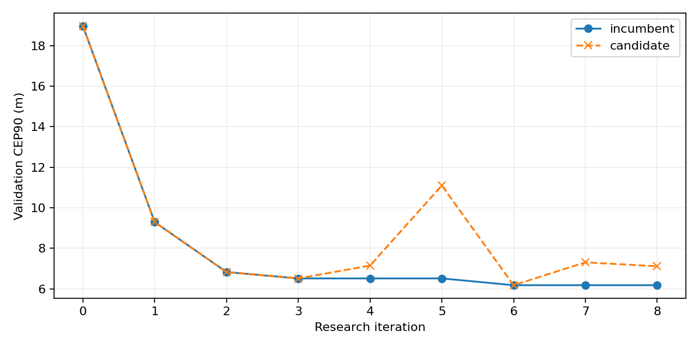
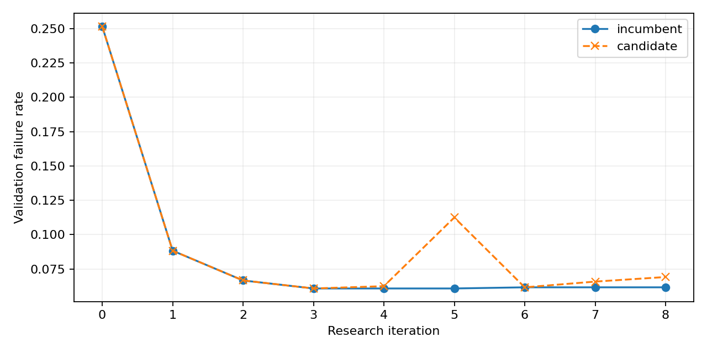
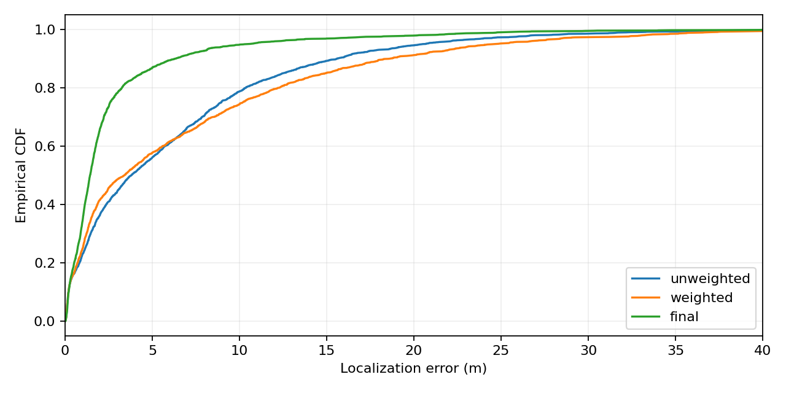
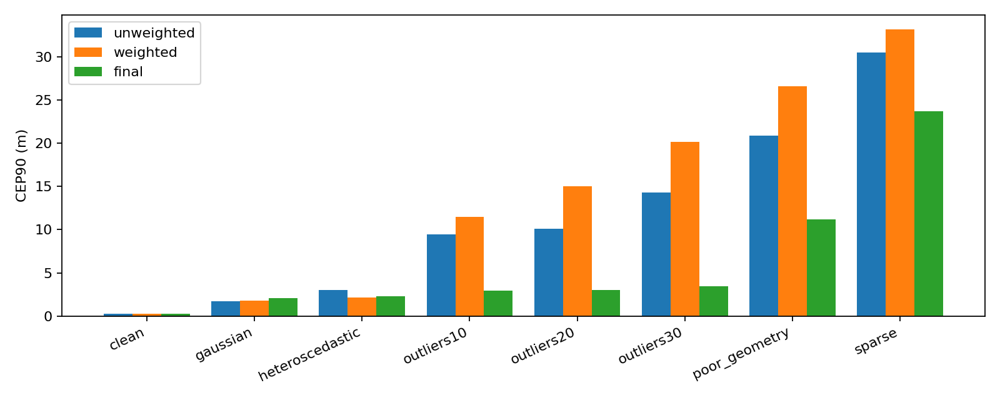
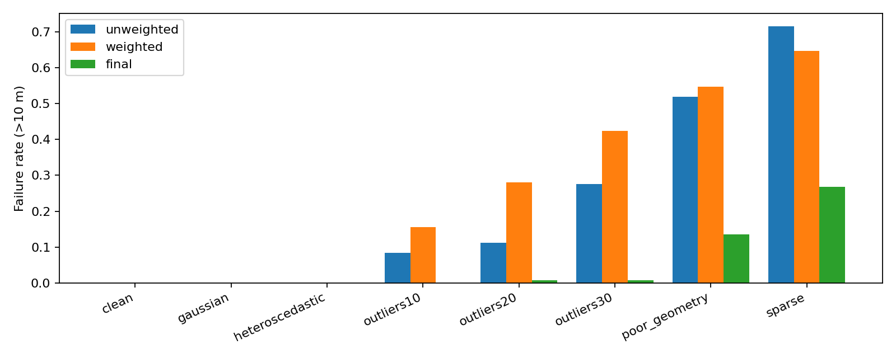
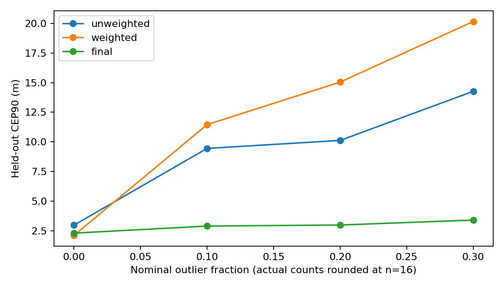
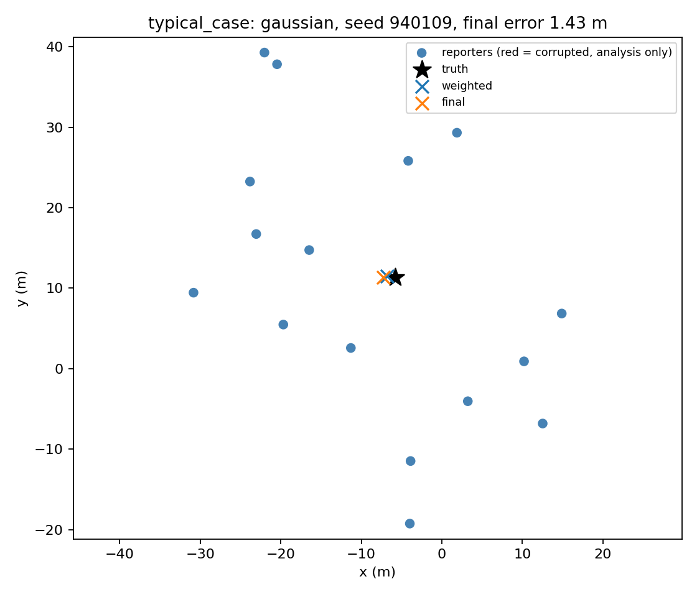
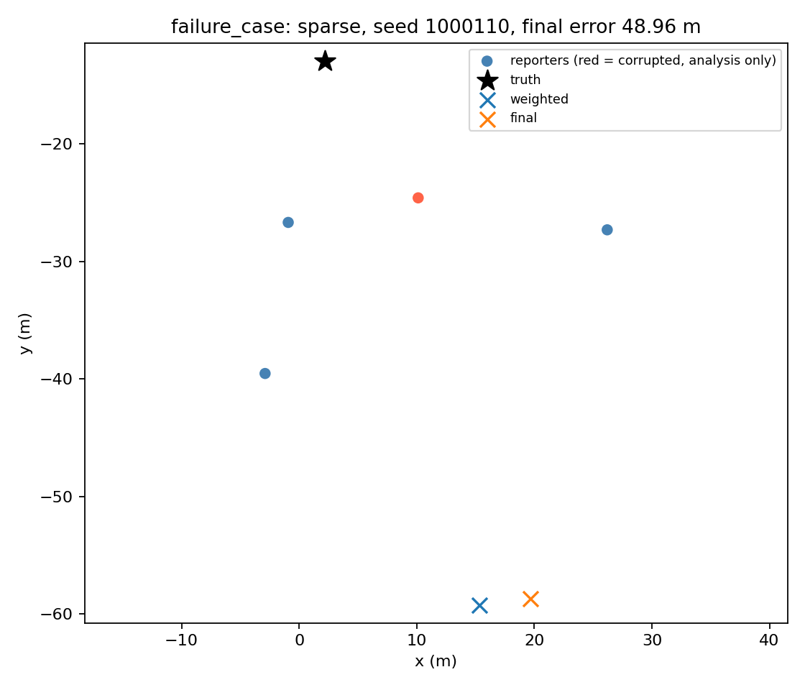

# RobustLoc-Agent

An Agent for Discovery and Verification of Robust Nonlinear Crowd-Localization Methods

## Abstract

A persistent bounded research agent tested 8 hypotheses on synthetic crowd-localization observations. The frozen method is iteration-6. On 2000 held-out cases, weighted baseline CEP90 was 18.652 m and final CEP90 was 6.344 m (66.0% relative reduction). Failure rates were 25.700% and 5.250%. These are simulation observations, not a proof or an industrial claim.

## 1 Introduction

Question: can a persistent agent improve tail localization performance under fixed heterogeneous and corrupted synthetic observations? This course project studies a finite family of robust estimators. It does not claim a newly invented robust loss or a solution to an established open mathematical problem.

## 2 Problem Formulation

For target x in R^2, reporter positions p_i and distance proxies d_i, residual r_i(x)=||x-p_i||-d_i. Unweighted NLS minimizes sum r_i^2. WLS minimizes sum c_i r_i^2/s_i^2, with s_i^2=distance_sigma_i^2+position_sigma_i^2. The variance approximation uses a first-order radial projection of isotropic position error. It is not an exact errors-in-variables likelihood. Robust candidates minimize sum rho(c_i r_i^2/(s_i^2 t^2))*t^2 using SciPy loss conventions. Nonconvex range residuals mean convergence is not a certificate of global optimality.

## 3 Why This Is a Mathematical Research Agent

The controller reads persistent incumbent metrics and research history, identifies a worst scenario, selects one untested hypothesis, modifies a solver configuration, executes tests and experiments, searches counterexamples, and submits results to an independent verifier process. Accepted and rejected hypotheses change subsequent parents and ordering. The proposer is an authored rule policy, not an LLM, and creativity is bounded by its method library. Skills guide human/Codex extension; the Python controller does not execute Markdown Skills or call Codex CLI.

## 4 Agent Architecture

Simulator -> immutable baselines/evaluator -> observation-only solver -> saved measurements -> verifier subprocess -> append-only history and atomic state -> proposer. Protected source hashes and historical baseline hashes are checked each round. This is an auditable integrity guard, not a security sandbox against arbitrary malicious Python. The verifier independently applies acceptance rules but shares simulator assumptions; it is not an independent scientific replication.

## 5 Synthetic Experimental Environment

Eight equally sampled scenarios: clean, Gaussian, heteroscedastic, 10/20/30% outliers, poor geometry, sparse reporters. Development: 100 cases/scenario; validation: 150; final held-out: 250. Split roots 110000, 220000, 930000; each scenario uses root+10000*scenario_index+case_index. RSSI error is approximated with additive Gaussian distance noise, clipped at 0.1 m; outliers add signed 15-45 m offsets. Reporter position error is isotropic. Confidence is independent uniform [0.65,1], not an oracle. Outlier counts are rounded (2,3,5 of 16); sparse has 1 of 4. Poor geometry uses a narrow angular arc. Freshness is preserved but unused. Moving targets are outside this phase.

## 6 Baselines

Both baselines use analytic Jacobians, a weighted centroid initialization, and a 150-function-evaluation budget per start. Optimization failure returns a finite centroid fallback with success=False, and both its error and failure are retained. Baseline development/validation results and tests were completed before any research round.

## 7 Autonomous Research Protocol

Only one mechanism changes relative to the incumbent each round. Independent acceptance requires at least 2% lower aggregate validation CEP90, at most 0.5 percentage points failure-rate increase, no scenario CEP90 exceeding max(0.25 m, 1.25*incumbent), and no increase in optimization failures or nonfinite cases. Supported means these empirical rules passed; rejected means regression/invalidity; otherwise inconclusive and retained as a branch. These thresholds were fixed before research. Repeated validation selection can overfit; the held-out split was evaluated only after freeze.

## 8 Iteration History

Iteration 1: robust_loss; parent weighted; supported; CEP90 9.294 m; failure 8.833%. Hypothesis: Replacing squared loss with Huber loss reduces contamination-driven tail errors. Motivation: Incumbent worst validation scenario: sparse, CEP90=31.465 m; last verdict=inconclusive.
Iteration 2: cauchy; parent iteration-1; supported; CEP90 6.831 m; failure 6.667%. Hypothesis: A redescending Cauchy influence suppresses large distance residuals more effectively than the incumbent loss. Motivation: Incumbent worst validation scenario: sparse, CEP90=30.989 m; last verdict=supported.
Iteration 3: adaptive_scale; parent iteration-2; supported; CEP90 6.516 m; failure 6.083%. Hypothesis: An observation-only MAD scale update improves robustness when nominal scales understate residual spread. Motivation: Incumbent worst validation scenario: sparse, CEP90=22.113 m; last verdict=supported.
Iteration 4: threshold; parent iteration-3; rejected; CEP90 7.149 m; failure 6.250%. Hypothesis: Changing the robust transition threshold addresses the observed worst-scenario tail. Motivation: Incumbent worst validation scenario: sparse, CEP90=24.206 m; last verdict=supported.
Iteration 5: soft_l1; parent iteration-3; rejected; CEP90 11.099 m; failure 11.250%. Hypothesis: Smooth soft-L1 curvature improves optimization stability relative to the incumbent loss. Motivation: Incumbent worst validation scenario: sparse, CEP90=24.206 m; last verdict=rejected.
Iteration 6: confidence; parent iteration-3; supported; CEP90 6.182 m; failure 6.167%. Hypothesis: Confidence is weakly informative here; removing it avoids unnecessary random weighting. Motivation: Incumbent worst validation scenario: sparse, CEP90=24.206 m; last verdict=rejected.
Iteration 7: uncertainty; parent iteration-6; rejected; CEP90 7.309 m; failure 6.583%. Hypothesis: Nominal heteroscedastic weights may amplify corrupted low-sigma reports; equal scales can reduce the tail. Motivation: Incumbent worst validation scenario: sparse, CEP90=23.803 m; last verdict=supported.
Iteration 8: multistart; parent iteration-6; rejected; CEP90 7.116 m; failure 6.917%. Hypothesis: Multiple deterministic initializations reduce local-minimum failures. Motivation: Incumbent worst validation scenario: sparse, CEP90=23.803 m; last verdict=rejected.

## 9 Final Method

{'name': 'iteration-6', 'config': {'loss': 'cauchy', 'threshold': 1.0, 'uncertainty': True, 'confidence': False, 'multistart': False, 'adaptive': True}}
The method and source hash were saved before accessing held-out results. No post-held-out tuning is allowed in this run. Huber and soft-L1 have bounded influence; Cauchy has redescending influence and a nonconvex robust objective. Multi-start compares the same robust objective across deterministic starts. MAD is a residual-based scale heuristic, not an unbiased scale estimate with fitted corrupted residuals.

## 10 Experimental Results

unweighted: mean 6.269 m; median/CEP50 3.797 m; CEP90 15.613 m; failures 21.350%; mean runtime 0.463 ms; optimizer failures 0; nonfinite 0.
weighted: mean 6.941 m; median/CEP50 3.405 m; CEP90 18.652 m; failures 25.700%; mean runtime 0.482 ms; optimizer failures 0; nonfinite 0.
final: mean 2.813 m; median/CEP50 1.431 m; CEP90 6.344 m; failures 5.250%; mean runtime 1.615 ms; optimizer failures 0; nonfinite 0.
Paired stratified bootstrap 95% CI, final minus WLS: CEP90 [-13.696033401473025, -11.140363003296626] m; failure rate [-0.22050000000000003, -0.18798750000000006]. Timing is hardware/load dependent. Bootstrap conditions on the selected estimator; it does not capture research selection uncertainty.

## 10.1 Scenario Results

| Scenario | WLS CEP90 | Final CEP90 | WLS failure | Final failure |
|---|---:|---:|---:|---:|
| clean | 0.246 | 0.283 | 0.000% | 0.000% |
| gaussian | 1.780 | 2.069 | 0.000% | 0.000% |
| heteroscedastic | 2.138 | 2.324 | 0.000% | 0.000% |
| outliers10 | 11.461 | 2.919 | 15.600% | 0.000% |
| outliers20 | 15.043 | 3.007 | 28.000% | 0.800% |
| outliers30 | 20.143 | 3.423 | 42.400% | 0.800% |
| poor_geometry | 26.618 | 11.214 | 54.800% | 13.600% |
| sparse | 33.168 | 23.671 | 64.800% | 26.800% |

## 11 Failure Cases and Negative Results

4 proposals were not accepted. Full positive-excess candidate-versus-incumbent cases are saved in every verification.json. Worst held-out final case: sparse, seed 1000110, error 48.965 m, optimizer success True. An optimizer can converge and still give an inaccurate estimate. Sparse measurements and near-collinear geometry remain fundamental difficulties. Final failure-case visualization was produced for analysis only, after freeze.

## 12 Limitations

Only synthetic, static 2D data; no real BLE calibration, map constraints, correlated/malicious errors, temporal tracking, or external replication. No Tukey estimator is implemented. The simulator, candidate library, and fixed selection rule were authored together; no novelty or independent invention is established. Equal scenario mixtures determine aggregate CEP90. Reused validation seeds induce selection bias. Confidence is intentionally uninformative. Integrity checks are policy enforcement, not process isolation. Paired bootstrap does not correct all multiple comparisons. Finite budgets and centroid baselines may disadvantage NLS; fairer stronger baselines are future work.

## 13 Conclusion

Under this project's synthetic benchmark, the frozen method achieved 66.0% aggregate CEP90 reduction relative to the defined WLS baseline. Per-scenario regressions, residual failures and runtime must be considered alongside this aggregate. Mathematical facts: metric definitions and specified objectives. Empirical evidence: saved experiments. Hypotheses: each proposal. Conjecture/unresolved: robustness under other noise distributions and real BLE measurements; no mechanism or global-optimality proof.

## Appendix: Reproducibility

Use Python 3.10+ and requirements.txt. Run python -m pytest -q; python agent.py baseline --run runs/reproduce; python agent.py research --run runs/reproduce; python agent.py finalize --run runs/reproduce. Do not overwrite run-001. Exact metrics reproduce under the saved numerical stack; runtimes vary. Files: manifest.json, environment.lock.txt, per-case JSON outputs, candidate snapshots, verifier requests/results, tests, state.json, hash-linked research_log.jsonl and frozen_method.json. Interrupted between log append and state commit: controller blocks on mismatch for explicit recovery, rather than inventing a round. GitHub publication requires an authenticated account and target repository.

## References

Conceptual inspiration: DeepMathLLM/Creative-Intelligence, https://github.com/DeepMathLLM/Creative-Intelligence (accessed 2026-09-30). SciPy least_squares documentation: https://docs.scipy.org/doc/scipy/reference/generated/scipy.optimize.least_squares.html. No source code was copied from the reference project.

## Figures

