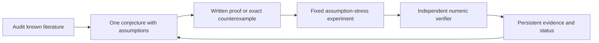

# RobustLoc-Agent theory-driven v2

v1 `run-001` 永久冻结，历史字节清单在 V1_FREEZE.json。v2 不继续优化旧
benchmark CEP90，独立研究“至多 q 个距离观测被任意污染时的几何可辨识性与稳定恢复”。

**known**：新定义的操作性名称 worst-case geometric information margin 对应
worst surviving lower frame bound，并非新 frame/FIM 结果。先读
[文献审计](LITERATURE_AUDIT.md)、[问题假设](PROBLEM_SPEC.md)、[证明与反例](THEORY.md)。

**proved-in-project**：有书面局部曲率证书、候选中心误差界、全平面 range
非共线判据推导；不声称新颖性或形式化验证。

**conjectured**：FFRG（先 residual feasibility，再 geometry certificate）是本项目
候选策略；未知 q、prior 可靠性、候选搜索完整性、实际性能优势仍待研究。



这是 Codex 会话研究 + Python 有状态任务控制器。控制器执行数学反例搜索和
实验，而非自动生成/形式化证明任意定理；任务库与依赖图预先定义。独立进程
复核数值证据，书面证明需数学审查，pytest 不构成 proof。

在仓库根目录运行（沿用已配置 Python 环境，无新依赖）：

```powershell
python -m pytest v2/tests -q
python -m v2.agent --run v2/runs/theory-001 --steps 6
python -m v2.audit_run
```

单回合 `--steps 1`；相同 run 可恢复。重现请使用新的 `--run v2/runs/reproduce`。
来源/配置/证明变化后拒绝续跑旧 run。结果见 [阶段报告](report/report.md)，
逐回合 proposal、evidence、verification、tests 与 hash-linked research_log.jsonl
保存在 runs/theory-001/。每项结果使用 known / proved-in-project /
conjectured / numerically-supported / refuted 五类状态。

数学假设细节与结果审查见 [REVIEW.md](REVIEW.md)。本次未证明候选策略有
更高定位精度，也未确立新颖性；当前主要产出是理论边界、反例和条件证书。
