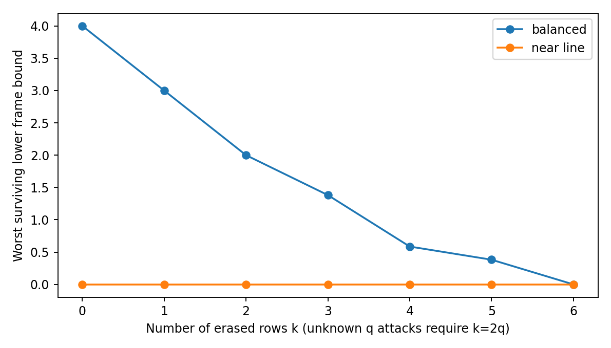
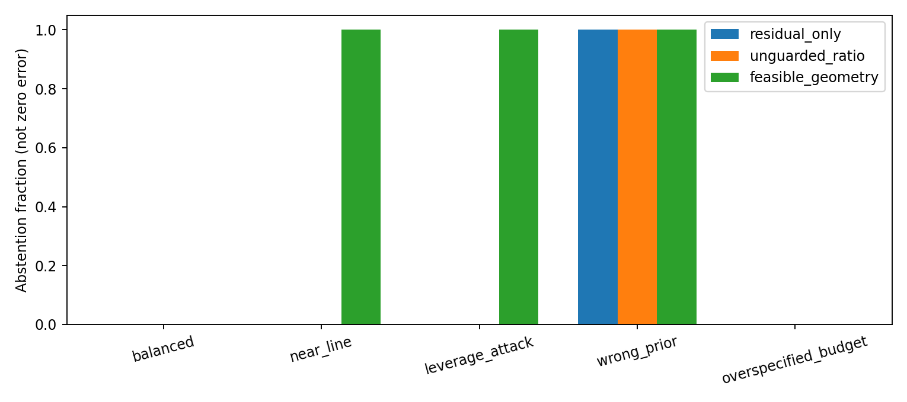
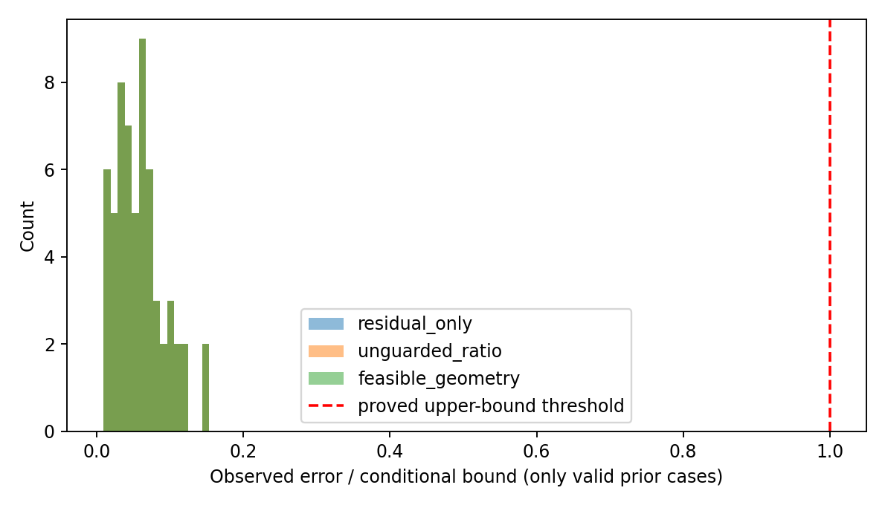

# Theory-driven v2：阶段研究报告

**known**：旧 run-001 永久冻结；本次不运行其 solver、不优化 CEP90。v1 文件哈希检查是完整性操作，不使用旧案例进行设计。

## 文献审计与贡献边界

**known**：FIM/GDOP、weighted frame operator、worst surviving frame bound、2q sparse correction、L1 balance、IRLS 与 trimming 都有既有理论或方法。详见 [LITERATURE_AUDIT.md](../LITERATURE_AUDIT.md) 和 references.json；全文与摘要阅读范围已区分。

**proved-in-project**：P1/P2 的局部曲率证书与 P3 的 range-specific 非共线判据有书面证明。这个标签只说明本项目完成推导，不宣称文献创新，也不表示 proof assistant 认证。

## 研究循环实际运行

本次 Codex 会话审计文献并写出证明/反例；Python 控制器按持久状态执行依赖式研究任务，独立 verifier 子进程复算证据。控制器不是自动形式化证明器，也不是开放式 LLM conjecture engine。预定义任务顺序与方法库是当前能力边界。

| 回合 | 主张 | 证据状态 | 后续 |
|---|---|---|---|
| 1 | R1 | refuted | Use exact support-splitting counterexample; choose 2q after rejection. |
| 2 | K2-K4 | numerically-supported | Distinguish known linear theory from nonlinear branch behavior. |
| 3 | R2-R4 | refuted | Reject overclaims; derive a local ball with curvature and anchor separation. |
| 4 | P1-P2 | numerically-supported | Test geometry/residual joint selection for reliability inversions. |
| 5 | C2 | refuted | If refuted, add residual feasibility gate before geometry. |
| 6 | C1 | numerically-supported | Retain unresolved performance conjecture; audit novelty and prior assumptions. |

## 主张账本

| ID | Status | Claim | Novelty |
|---|---|---|---|
| K1 | known | Range Gram/frame operator and FIM under specified Gaussian likelihood | known |
| K2 | known | 2D analytic worst surviving lower frame bound and determinant formula | known |
| K3 | known | 2q sparse support/rank condition for linearized correction | known |
| K4 | known | 2epsilon/gamma linear feasible-decoder bound | known linear algebra corollary |
| P1 | proved-in-project | Explicit curvature-limited ball and local nonlinear stable recovery | not claimed; direct specialization, audit not exhaustive |
| P2 | proved-in-project | Candidate-centered conditional beta certificate after residual gate | not established |
| P3 | proved-in-project | Every n-2q anchor subset noncollinear iff global planar range q-correction | not claimed; elementary range specialization |
| R1 | refuted | alpha_q positive suffices for unknown q corruptions | no claim |
| R2 | refuted | positive alpha_2q at truth implies global nonlinear uniqueness | no claim |
| R3 | refuted | positive alpha_2q guarantees L1 correction | known mechanism |
| R4 | refuted | zero margin rules out exact pointwise uniqueness | no claim |
| C1 | conjectured | Feasibility-first residual/geometry ranking improves practical stability within trusted basins | not established; not a new frame or FIM result |
| C2 | refuted | Unguarded residual/geometry ratio always improves finite-pool selection | not established |

## 可执行验证

**numerically-supported**：300 个随机矩阵上，解析 margin 与独立 eigvalsh 的最大差为 2.931e-14；线性界最大 observed error/bound 为 0.314730。
**numerically-supported**：150 个局部区域上遍历保留子集并抽样位置对，最小 observed output-separation / proved lower-bound 为 1.396507。这些不是全称证明。

**refuted**：R1 区分 q-erasure 与 q-corruption；R2 反射构造区分局部 margin 与全局分支；R3 区分 sparse identifiability 与 L1 decoder 条件；R4 区分 exact pointwise uniqueness 与 Lipschitz stability。精确论证见 THEORY.md。

**refuted**：C2 在 seed=65171、trial=79 找到实际 range-map 两候选反例：residual-only T=1.045374，ratio-selected T=1.099314；后者超出 noise feasibility gate，并且位置误差更大。反例仅证否有限候选池的普遍优势/fit-reliability 主张，不声称证明任意连续优化目标都失败。

## 联合估计策略：FFRG

**conjectured**：Feasibility-First Residual–Geometry (FFRG) 是本项目候选组合策略，新颖性尚未确立。Residual reliability 由 q-trimmed weighted residual norm 定义；先筛选 ≤epsilon+tau，再最大化候选的 beta 信息证书。不会为了恢复几何强行增加可疑 residual 的权重。

**proved-in-project**：若 truth 与 estimate 均属于可信 prior ball、exact anchors、≤q 任意污染、fixed positive weights 且真实 whitened inlier norm≤epsilon，则任何 gated、beta>0 的 candidate 都满足 (2epsilon+tau)/beta 的条件误差界。

**conjectured**：找到 feasible solution 的 completeness、实际误差比 residual-only 更小、不可信 prior 与未知 q 情形的稳定性均未解决。选择最大 beta 只最大化这个保守条件证书，不等于最小化真实误差。

## 固定假设压力实验

**numerically-supported**：共享有限候选池，三种选择规则作机制对照；seed 和场景在运行前固定。Median error 只描述结果，不用于选参数或验收。No estimates 时不会把 abstention 当作0误差。

| Scenario | Selector | Estimates / cases | Abstain | Median error (m) | Applicable bounds | Violations |
|---|---|---:|---:|---:|---:|---:|
| balanced | residual_only | 30/30 | 0 | 0.00216 | 30 | 0 |
| balanced | unguarded_ratio | 30/30 | 0 | 0.00216 | 30 | 0 |
| balanced | feasible_geometry | 30/30 | 0 | 0.00216 | 30 | 0 |
| near_line | residual_only | 30/30 | 0 | 0.04129 | 0 | 0 |
| near_line | unguarded_ratio | 30/30 | 0 | 0.04129 | 0 | 0 |
| near_line | feasible_geometry | 0/30 | 30 | N/A | 0 | 0 |
| leverage_attack | residual_only | 30/30 | 0 | 0.05776 | 0 | 0 |
| leverage_attack | unguarded_ratio | 30/30 | 0 | 0.05776 | 0 | 0 |
| leverage_attack | feasible_geometry | 0/30 | 30 | N/A | 0 | 0 |
| wrong_prior | residual_only | 0/30 | 30 | N/A | 0 | 0 |
| wrong_prior | unguarded_ratio | 0/30 | 30 | N/A | 0 | 0 |
| wrong_prior | feasible_geometry | 0/30 | 30 | N/A | 0 | 0 |
| overspecified_budget | residual_only | 30/30 | 0 | 0.00238 | 30 | 0 |
| overspecified_budget | unguarded_ratio | 30/30 | 0 | 0.00238 | 30 | 0 |
| overspecified_budget | feasible_geometry | 30/30 | 0 | 0.00238 | 30 | 0 |

**numerically-supported**：wrong_prior 场景出现 0 个数学形式为正、但 truth 不在 prior 内的条件输出（跨三种规则计数），这些都不纳入有效 bound 检查。Prior coverage 无法由污染观测自动认证；模型假设错误可能导致 abstention，也可能产生不适用的条件保证。

## 未解决与下一步

**conjectured**：需要审计更接近的 geometry-aware trimming / robust design / certified nonlinear estimation 文献后才谈新颖性；改进 search completeness（而非 CEP90）；研究未知 q 与不可信 prior 的 set-valued ambiguity 输出；引入 anchor uncertainty 时重推 Hessian/noise 模型。

## 复现与冻结

从仓库根目录：`python -m pytest v2/tests -q`；`python -m v2.agent --run v2/runs/reproduce --steps 6`。单回合使用 `--steps 1`，同一 run 恢复日志。源代码/理论修改后必须新建 run，不能覆盖历史。`python -m v2.audit_run` 只检查保存结果。

## 图表（numerically-supported）

