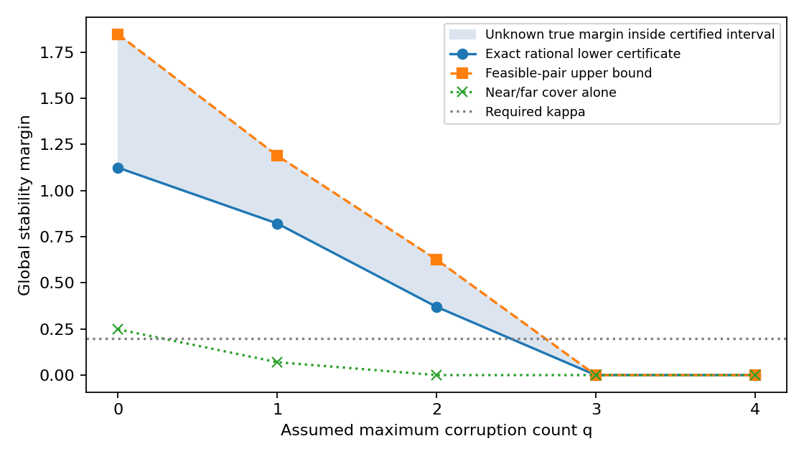
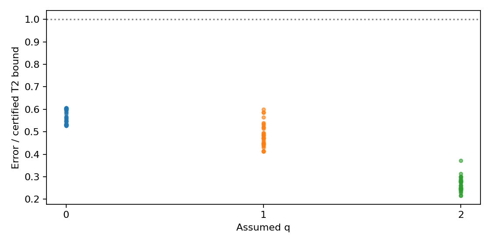

# Phase 2 实际运行报告

Global Stable Recoverability of Planar Range Localization under Sparse Adversarial Corruptions

**proved-in-project**：T2 全局 residual-feasible 误差界、修正域条件后的 T3、T4 近远区证明、T5 可计算散布矩阵下界已写出。T5 进一步允许 bounded D 包含 anchors。证明见 ../../global_stability/THEORY.md；不是形式化机器证明，新颖性未确立。

**known**：排序式、支持并集 2q、lower-Lipschitz 定义、加权散布恒等式及 q 单调性；文献中的 set-membership、q-relaxed intersection、几何一致性不能作为本项目新贡献。

**refuted**：C3 的精确点对给出 μ₁=0；两个完整小方形上的 γ 均≥0.03178664>0。D 是两个不连通的二维方形，不能声称已解决 connected/convex 附加条件。另保留 thin-domain T3 和 unbounded-domain 稳定性反例。

## 条件 corruption–stability profile

输入：8 个 radius-5 有理圆周 anchors，固定 w=1，D=[-1,1]²；κ=0.2。证书作用于整个矩形，非 Monte Carlo 下界。

| assumed q | certified lower b ≤ μ | feasible-pair upper μ ≤ U | raw near/far lower | unresolved far leaves |
|---:|---:|---:|---:|---:|
| 0 | 1.12372377 | 1.84642620 | 0.24809986 | 0 |
| 1 | 0.82136890 | 1.18865477 | 0.06982064 | 0 |
| 2 | 0.36986843 | 0.62579699 | 0.00000000 | 0 |
| 3 | 0.00000000 | 0.00000000 | 0.00000000 | 323 |
| 4 | 0.00000000 | 0.00000000 | 0.00000000 | 363 |

**proved-in-project**：κ=1/5 时 q_cert 的认证下限=2，可行上限=2。两者相同才在这个 κ 下确定最大预算；未计算各 μ 的精确真值。q=3 的反射点对保留两个相等坐标，严格给出 μ₃=0；q≥4 按空 survivor 约定为 0。这些结果不估计实际数据中 q。

q=0 的 near/far-only 下界=0.24809986>0，覆盖使用 44 个叶盒。其余 raw 值/预算耗尽数见表；combined 下界使用独立 T5 兜底。raw=0 表示该覆盖预算未认证正性，不能解释成 μ=0。

**numerically-supported**：100 个合成双解释案例满足 T2；max(error/bound)=0.60601743。每个 case 均记录两套 residual budgets 和 bad supports。这不是 estimator accuracy 实验，未产生 FFRG 性能结论。

## Agent 循环与证据限制

Codex 会话写出证明，有限 Python 控制器执行 8 个实际任务，按已验证反例决定是否进入域条件修复、bounded-domain 证书和 q profile。runtime 不自动发明任意定理，也不把固定任务表包装成 LLM 自主发现。独立进程重算有理数证书、完整 subset、完整二叉覆盖、点对上界和数值 residual。共享最小算术原语，因此不声称实现多样性或形式化可信内核。

| iteration | claim | actual verified label |
|---:|---|---|
| 1 | T1 | numerically-supported |
| 2 | R-domain | refuted |
| 3 | T3 | numerically-supported |
| 4 | C3 | refuted |
| 5 | T5 | proved-in-project |
| 6 | R-unbounded | refuted |
| 7 | E-profile | proved-in-project |
| 8 | E-T2-stress | numerically-supported |

**conjectured / unresolved**：原创性；Calafiore 全文 theorem-level 对照；更紧 μ 值、可扩展 subset 下界；connected/convex 域上的更强 local/global 关系；真实工作域和噪声预算可靠性；uncertain anchors；具体 decoder 的可行性和搜索完整性。

复现：仓库根目录 `python -m v2.global_stability.agent --run v2/runs/global-stability-reproduce --steps 8`。历史审计：`python -m v2.global_stability.audit_run`。source/配置变化会拒绝续跑；新研究应开新 run。v1 94 个冻结文件和 phase 1 source hashes 均由每轮检查保留。
