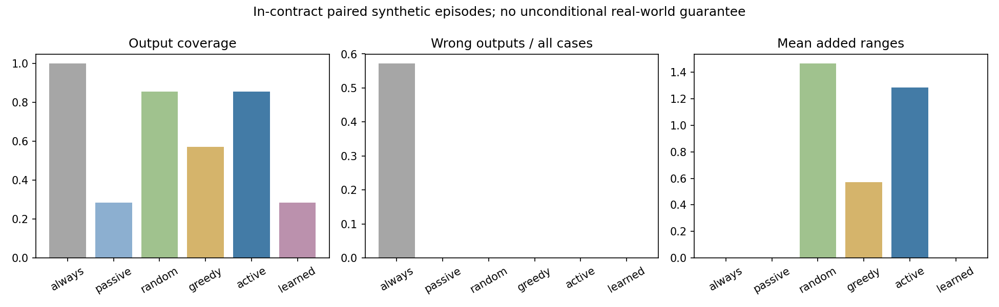
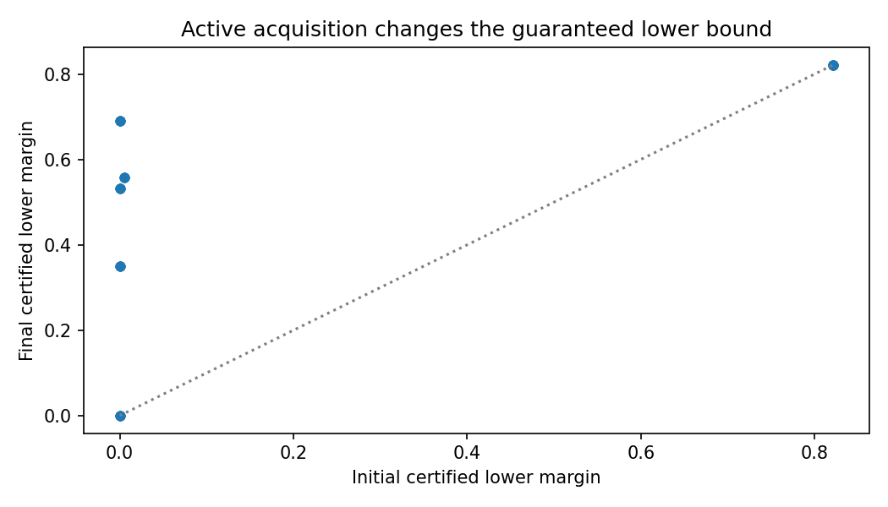
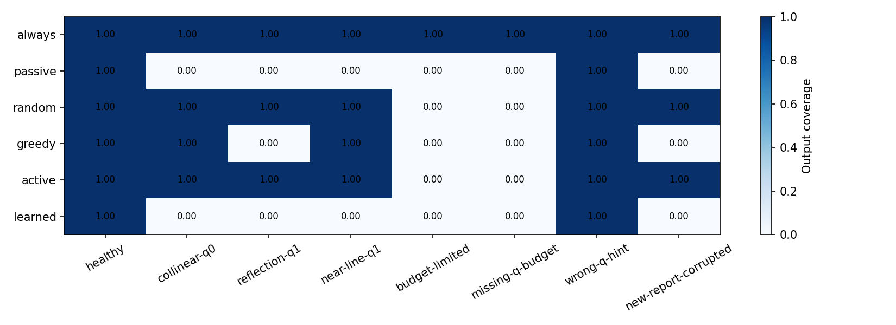

# Phase 3A：从 certificate 到 adaptive decision 的实际运行

MathResearch-Agent: Certified Adaptive Localization (range case study)

**numerically-supported**：已执行 observation → certificate → decision → acquire → reverify 闭环。每个请求在仿真环境中取得一个真实生成的新 range，累计预算保持原样，然后重新认证。有限规则/前瞻控制器不等于 LLM 自主定理发现。

共 792 个 method–episode 结果，132 个 paired episodes；训练 240、模型测试 120 个独立几何布局。历史 248 个 v1/v2 文件逐字节不变。

## 条件有效场景：风险、覆盖率与成本

| method | outputs / cases | coverage | wrong outputs | selective risk | mean acquisitions | bound violations |
|---|---:|---:|---:|---:|---:|---:|
| always-cauchy | 84/84 | 1.000 | 48 | 0.571 | 0.000 | 0 |
| passive-certified | 24/84 | 0.286 | 0 | 0.000 | 0.000 | 0 |
| random-certified | 72/84 | 0.857 | 0 | 0.000 | 1.464 | 0 |
| greedy-certified | 48/84 | 0.571 | 0 | 0.000 | 0.571 | 0 |
| active-certified | 72/84 | 0.857 | 0 | 0.000 | 1.286 | 0 |
| learned-gate | 24/84 | 0.286 | 0 | 0.000 | 0.000 | 0 |

**numerically-supported**：always-Cauchy 错误输出 48/84；active-certified 为 0/84，同时输出 72/84，平均新增 1.286 次观测。passive-certified 输出 24/84，用以检查 active 是否只靠拒绝获得安全。

严格 μ 提升案例 48：只在 post-lower > pre-upper 时计数。其他变化仅称 certified lower gain，不能解释为测得 μ 真值。单步与随机方法在相同预算及环境规则下比较；缓存影响 wall runtime，本阶段不主张运行速度优势。

## 反例与前瞻

**refuted**：q=1、4 个共线旧 anchors 时，加一个新 anchor 仍可保留 3 个旧共线坐标，reflection 给 μ=0；“加一个必然恢复”失败。前三步中 immediate lower 可以保持零，而 3 个新 reporters 的组合能够越过阈值。单步 positive-gain greedy 会停止；horizon agent 执行获取后逐步重新认证。budget-limited 场景拒绝输出并保留原因，不强制做无效采集。

## 学习型诊断的证据边界

**numerically-supported**：独立模型测试中 113 个可区分标签、7 个 unknown；accuracy=0.991，false-positive=1，false-negative=0，Brier=0.0094。这些是 certificate-separated synthetic labels，未学习到精确 μ，也未得到概率安全保证。unknown 没有被标为 0。

预测器对 certified policy 只作建议；learned-gate 是无证书对照。估计 q 不参与恢复授权；missing-q-budget 场景输出 conditional capacity profile 后拒绝。capacity_lower 只覆盖已计算 q≤profile_max_q，不能称为实际 q 或完整最大容量。

## 假设失效场景

| method | outputs / cases | wrong outputs | bound violations |
|---|---:|---:|---:|
| always-cauchy | 48/48 | 12 | 0 |
| passive-certified | 0/48 | 0 | 0 |
| random-certified | 0/48 | 0 | 0 |
| greedy-certified | 0/48 | 0 | 0 |
| active-certified | 0/48 | 0 | 0 |
| learned-gate | 0/48 | 0 | 0 |

真位置不在 D、clean noise 超预算、实际 bad support 超 q 或 q_budget 缺失均单列；数学证书不能证明这些假设在真实系统成立。新观测污染 stress 使用“首个新 reporter 被污染”的一致响应规则；各政策的坏 reporter 位置可能不同。

## 已实现与未完成

**known**：reject option、active sensing、sensor placement、Cauchy/trimmed LS 和 logistic regression 是已有方法。**proved-in-project**：输出门控复用 Phase 2 T2/T5，独立消费者重算精确几何与 residual，并检查传感器预算和轨迹一致性；不声称正式形式化验证或新数学定理。

**conjectured / unresolved**：真实环境 q/domain/noise contract 的可靠来源、uncertain anchors、动态目标、全局 decoder 完整性、跨 inverse problems 的通用性、硬件观测成本与人机请求执行。无真实 BLE/众包部署，无新颖性或工业适用性声明。

代码入口：`python -m v3.certified_agent.run --run v3/runs/certified-agent-reproduce`；只读审计：`python -m v3.certified_agent.audit`。数据/动作/证书/模型/失败都保存在此 run。源文件/配置变化后必须开新 run，不改历史。
