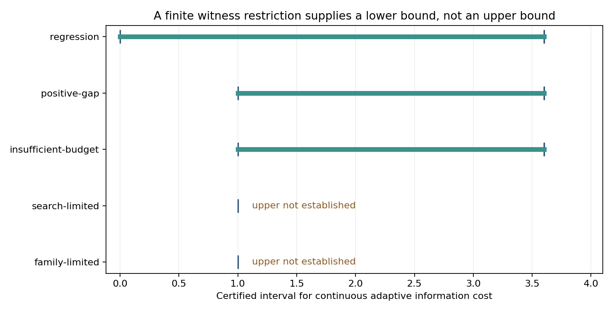

# Phase 3C 阶段报告：最小信息成本上下界

日期：2026-10-04。实现位于 `v3d/minimal_trust`。源码、配置和种子在正式运行前冻结；旧版本基线为 `a4d5057`，此前 3,686 个已跟踪文件逐字节保持不变。

本阶段完成了可执行、可复核的成本区间 Agent：从当前 transcript 构造物理可行世界限制，用危险二元/三元见证和精确决策树计算下界；通过参考购买与 measurement subset search 计算上界；据此输出预算不足、可认证恢复或尚未解决。范围仍是小规模合成 range-localization 模型，没有证明一般连续最小信任问题已解决。

## 先纠正一个会使下界失效的推理

**refuted：全局最小 hitting-set 成本不一定是自适应最坏成本的下界。** 固定批次必须同时分开所有危险世界；自适应策略可先观察回复，再只支付当前分支所需的测试。项目保留了物理可实现的四世界反例：三个单位成本测试的批次最优为 3，自适应最优为 2。正式价格变体改变比例尺度，不改变这个反例。

**proved-in-project：** 改为每个世界路径上必须击破所有包含该世界的危险 hyperedge，再对各世界下界取最大值；更强的有限下界由精确 minimax 决策树提供。下界消费者核验全部可用动作，不能通过遗漏便宜动作人为抬高成本。它还检查每个假想回复的物理可行性以及所有未来普通观测合并后的总噪声预算。

**refuted：** 仅检查两点距离不超过 `2 rho` 不能保证二维可包围半径合格。固定三角形 `(-1,0),(1,0),(0,3/2)` 的半径为 `13/12`，超过 `rho=21/20`，但每一对都合格。因此保留 pair 和 triple witnesses。

**known：** Helly 定理、最小包围圆、加权覆盖、带成本决策树及子模型限制单调性已有文献。P1–P8 是本项目明确条件下的推导与验证记录，不是新颖性声明。参见 [理论](../minimal_trust/THEORY.md) 和 [原始文献审计](../minimal_trust/LITERATURE_AUDIT.md)。

## 强制回归：自动找回成本 3.6 的证书

**numerically-supported：** 购买组合和观测子集均由枚举选择，没有把 `a0/a1/a2` 硬编码为修复方案。原开发实例自动购买三项参考，支出 `18/5=3.6`，选择观测坐标 `[0,1,2]`：

| 实例 | 旧全观测 pre-bound | 新的实际交付后 radius bound | 支出 |
|---|---:|---:|---:|
| 原开发实例 | 0.2429757702 | 0.01133228055 | 3.6 |
| 冻结变体 0 | 0.2429757702 | 0.01141670507 | 3.6 |
| 冻结变体 1 | 0.2460026139 | 0.01159044741 | 3.6 |
| 冻结变体 2 | 0.2429757702 | 0.01119697548 | 3.6 |

原实例与三个冻结变体均修复，实际误差均在消费者验证的半径内。这里比较的是同一交付后 transcript 的旧 pre-bound 与新子集证书，不能将两者当成定位误差本身。预购买上界另用初始 anchor balls 上的统一几何下界，量化全部允许的精确参考回复；实际输出仍需交付后的残差证书。

**尚未证明成本 3.6 最优：** 原实例的物理区间是 `[0,3.6]`，绝对 gap 为 3.6。搜索完整只说明当前充分证书族中更便宜的购买组合未通过，不能把它变成物理成本下界。

## 真正闭合了哪些成本界

**proved-in-project：有限完整先验。** 24 个实例来自六个固定模板的四组价格变体：20 个有限精确最优，另外 4 个在完整菜单下不可能恢复。20 个有限最优中包含 4 个零成本近邻实例。这不是 24 个独立几何发现，也不是连续几何泛化实验。消费者以独立的 Helly 阈值判断、穷举覆盖和自底向上 Bellman 递推复核；所有成功树都在每个目录世界执行。预算不足实例中的树执行仅是最优策略的反事实验证，决策器不会将它认定为预算内可执行。

**proved-in-project：连续模型的一个精确特殊族。** 两个精确已知 anchor 位于 `(+/-3h/4,0)`，其距离均为 `5h/4`，故目标必为 `(0,+/-h)`。未知 anchor 满足 `||p||<=2h` 且目标距离为 `3h`；三角不等式取等迫使 `p=-2x`。因此连续物理世界恰好只有两个，而不是只抽样两个。只有购买未知 anchor 的绝对参考能区分它们；菜单中的普通距离、已知参考和内禀 baseline 均不能。完备性消费者检查这些条件后，才允许转移有限策略的上界。

| h | 连续成本下界 | 连续成本上界 | gap |
|---:|---:|---:|---:|
| 1 | 1.4 | 1.4 | 0 |
| 1/2 | 0.7 | 0.7 | 0 |
| 3/2 | 2.1 | 2.1 | 0 |

这是**同一个解析构造的三个尺度**，严格依赖 `q=r=E=0` 和切触等式。增加噪声、放宽球半径或漏掉世界时，消费者拒绝该完备性证明。它没有解决正噪声、未知污染或一般连续 nuisance 的最优性。

## 一般连续实例保留的 gap

**numerically-supported：** 15 个冻结实例分为五族、每族三个扰动变体；其物理成本均未闭合。三态数量为：可认证恢复 3，已证明预算不足 3，未解决 9。

| 代表情形 | 物理成本区间 | 决策预算 | 诊断 |
|---|---|---:|---|
| regression | `[0,3.6]` | 3.6 | 可认证恢复 |
| positive-gap | `[1,3.6]` | 2 | 未解决；gap=2.6，相对 gap=13/18 |
| insufficient-budget | `[1,3.6]` | 0.5 | 已证明预算不足 |
| search-limited | `[1,未知]` | 2 | 达到一个节点的搜索上限 |
| family-limited | `[1,未知]` | 2 | 当前证书族已穷举但无上界 |

`未知` 不等于正无穷，也不证明问题不可能。`lower > budget` 才支持预算不足结论。单纯穷举某个证书族失败，仍无法判定需要哪个更强方法。



## 三种失败原因有了各自的正面证据

1. **物理不可解：proved-in-project。** 四个不可分反射实例的危险两世界见证，在完整菜单的每个动作下回复相同，因此任意策略都无法将半径降至阈值。这个否定结果可从有限限制转移到包含它的连续模型。
2. **证书保守：proved-in-project。** 三个解析切触实例中，初始 hard-ball 统一几何证书族穷举仍失败；利用距离等式的完备性证明却给出了非零精确可行成本。这里有替代方法成功的证据，不是从穷举失败猜测保守性。
3. **搜索不完整：numerically-supported。** 三对 search-limited/positive-gap 输入除 episode id 外完全相同；一个节点上限找不到上界，完整搜索找到 3.6。比较结果写入 [诊断绑定记录](diagnostic_distinctions.json)。

这些例子表明三者确实可区分，但 Agent **尚不能对每个未解决输入自动确定唯一失败原因**。这仍是后续研究问题。

## 实际执行与复现

- 全项目 **145 passed**，其中 v3d 新增 32 项；包含开发种子的端到端运行与数学消费者检查。命令和源码哈希见 [测试记录](test_verification.json)。
- 正式运行：24 个有限实例、15 个一般连续实例、3 个解析特殊实例，加 1 个强制开发回归，共 43 个案例。
- 正式审计：9 份唯一几何证书、78 个哈希链事件；此前 3,686 个文件未改动。见 [audit.json](minimal-trust-001/audit.json)。
- 两次新目录运行的 **64 个科学产物逐字节一致**，包括图表、证书、报告、结果和审计。只排除运行时间文件及包含它的输出哈希清单；每次运行各自仍通过全部输出哈希检查。见 [复现记录](reproduction_verification.json)。
- 正式核心运行记录为 7.282 秒，复现为 7.388 秒；此计时在绘图和最终审计之前截止，不代表端到端工具耗时。
- 一般连续冻结实验：subset 节点 126，统一证书节点 16,014；有限实验：adaptive states 128，cover nodes 608；42 个正式案例共 263 个危险见证。原开发回归未计入这些汇总搜索量。
- 三种 CLI 输入实际执行并保存到 `cli-preview/`：原回归输出 `[0,3.6]`，解析实例输出 `[1.4,1.4]`，限额搜索输出 `[1,未知]`。

复现命令（仓库根目录，使用新目录名）：

```powershell
..\.venv\Scripts\python.exe -m v3d.minimal_trust.run --run v3d/runs/minimal-trust-reproduce-new
..\.venv\Scripts\python.exe -m v3d.minimal_trust.audit --run v3d/runs/minimal-trust-reproduce-new
```

## 边界与下一步判断

**known / proved-in-project / conjectured / numerically-supported / refuted** 已分别进入 [结论台账](minimal-trust-001/CLAIM_LEDGER.json)。独立消费者指不同计算路线及原始输入绑定，不代表独立作者或形式化证明助手；原计划的三个子任务因用量限制在写入源码前停止，此实现由主 Agent 完成，未声称完成外部同行审查。

信任根真实、噪声覆盖、domain 覆盖、q/r 和 source group 仍是外部契约。本轮正式有限与解析实例为 q=r=0；一般连续实例沿用 q=0、r=1 且无 soft-source reports 的 hard-ball 输入，因而不是非零污染预算下的广泛实证。一般连续下界只搜索少量可行平移世界，上界族只购买精确绝对参考；非线性候选搜索和分支球并集中心选择也不完备。实现没有加入新服务、覆盖率调参、第二个逆问题或 LLM 自主发现声明。

**conjectured：** 更强的可行世界构造及利用观测等式的统一上界，可能缩小现存连续 gap。下一项合理研究对象是固定 `[1,3.6]` 实例的上下界差距及正噪声下的完备性，而不是依据这个特殊零噪声闭合就宣称可迁移的一般最小信任理论。
