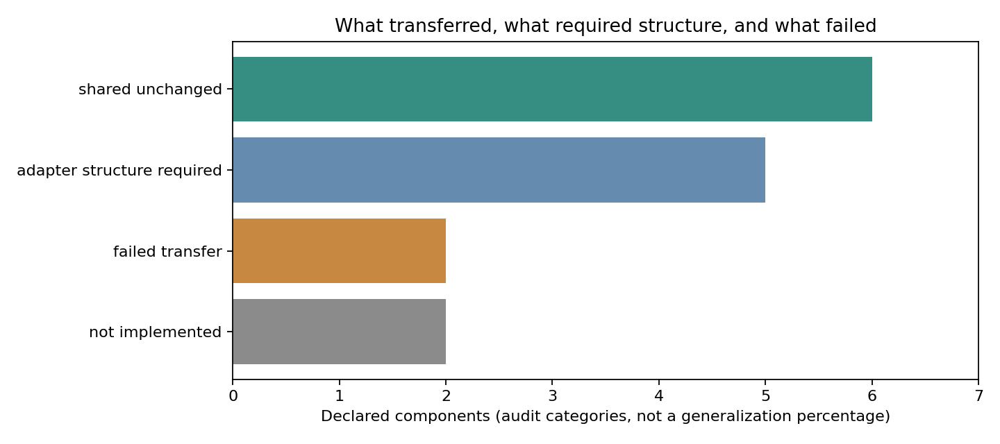
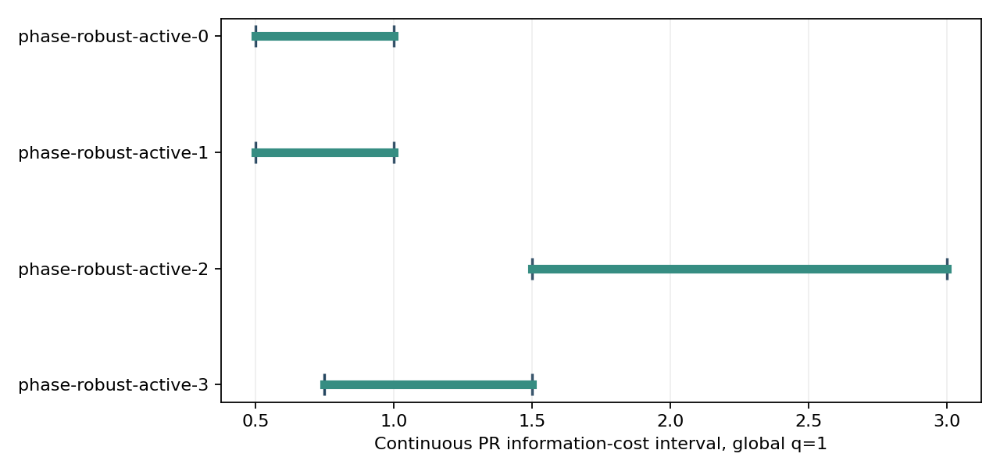

# Phase 4 第一阶段报告：从 range 到实数 phase retrieval

日期：2026-10-04。新实现位于 `v4/core` 与 `v4/problems`；v1–v3d 在 `7c16b09` 的 **3,862 个文件保持逐字节不变**。本阶段没有接入 LLM proposer，也没有继续优化 range 的 `[1,3.6]`。

**结论：已跑通同一个确定性研究与认证 core 在两个问题上的闭环，并留下了不能原样迁移的具体反例。** 这支持本轮限定范围内的结构复用；尚不构成普适逆问题框架或自主数学发现能力的证明。

最终验收入口是 [evaluator v2 审计](cross-problem-v2-001/audit_v2.json)。原运行和原源码未覆盖；文末说明版本化检查的原因。

## 四项任务的实际交付

| 要求 | 完成内容 | 证据状态 |
|---|---|---|
| 抽象 `InverseProblem` | 观测、状态距离、等价关系、定义域、有限世界过滤、margin 证书与消费者接口；core 不导入任一 problem adapter，也不按问题名称分支 | 已实现；接口隔离测试通过 |
| 原 range 完整回归 | 所有 43 个 Phase 3C 案例的成本区间和预算状态经新 core 重算一致；4 份实际交付后的 subset 输出一致；更早各阶段全测试通过 | numerically-supported |
| Phase Retrieval adapter | 实数二维平方强度、sign quotient、CP 检查、连续 annulus 上的保守裕度及独立计算消费者 | known / proved-in-project，非新 PR 理论 |
| 实际研究闭环 | 同一函数执行 symmetry → 2q support-union → robust bound → ambiguity witness → active information decision，并执行真实模拟回复 | numerically-supported；任务顺序由人预先给定 |

核心文件见 [problem.py](../core/problem.py)、[research.py](../core/research.py)、[certificate.py](../core/certificate.py)、[decision.py](../core/decision.py)。两个 adapter 见 [range](../problems/range_localization.py) 与 [phase retrieval](../problems/phase_retrieval.py)。Range 专用数学继续调用冻结实现；没有为 PR 复制一套 v2/v3/v3d 应用。

## 哪些东西确实共用，哪些仍依赖问题

| 类别 | 本轮结果 |
|---|---|
| 原样共用的证明或控制逻辑 | `q→2q` 支持并集；给定正裕度后的恢复误差界；候选验证与拒绝输出；有限 minimax / 逐世界路径下界；三态预算诊断；研究与回复驱动的执行循环 |
| 必须提供 adapter 结构 | 有效对称性、状态度量、连续正裕度、半径计算、物理回复绑定、面向所有未来回复的 acquisition 上界 |
| 已明确失败的原样迁移 | 欧氏二维“三点足够”的 witness 限制；由 phase retrievability 直接推出原点附近正的平方强度/d_pm 裕度 |
| 本轮未实现 | 未知 PR sensing vectors 的 nuisance / gauge 推理；任意群或维度；一般连续 minimax；LLM 自主提出 conjecture |

完整 [迁移矩阵](cross-problem-v2-001/scientific/transfer_matrix.json) 是预先声明的组件审计，不是独立抽样的科研能力测评。因此没有把表格格子数包装成“泛化成功率”。



## 一条真正不依赖 h 的证明

**proved-in-project，通用已知结构的项目化证明：** 若两个状态各自允许最多 q 个任意污染，其共同干净坐标至少有 `m−2q` 个。在该交集上应用三角不等式，就得到

\[
\mu_q(D)\,d_X(x,z)\le \varepsilon_x+\varepsilon_z.
\]

这里没有使用 range 或 phase-retrieval 公式。Range 的 `d_X` 是欧氏距离，PR 的 `d_X` 是 `min(||x−z||,||x+z||)`。同一恢复器读取 adapter 的正 margin 下界并验证候选残差；真实目标与候选都满足声明的连续定义域与污染契约时，该误差界适用。

**需要专用数学的是正 margin 的来源。** PR adapter 在 `1/2 ≤ ||x|| ≤ 3` 上，对全部 `m−2q` survivor 构造 lifted Gram 矩阵，用 `det(G)/trace(G)^2` 及 annulus 条件给出保守下界。消费者通过 Cauchy–Binet 的平方子式和重算 determinant。没有将网格上的最小比值当作连续域下界。推导、条件及精度方向见 [THEORY T1–T4](../THEORY.md)。

## 四类被保留的反例

1. **refuted：同观测必然是同一个原始向量。** `x=(1,2)` 与 `−x` 的原始距离平方为 20，而 PR 商距离为 0。程序在八个预先给定的候选变换上搜索，并用 adapter 的代数恒等式验证普适不变性；它识别 sign，并拒绝错误的 literal-state 接口。这里的候选族和代数检查器由人提供，没有宣称无约束发现群结构。
2. **refuted：删掉 q 个后可 phase-retrieve 就足以抵抗 q 个未知污染。** 对 sensing vectors `(1,t), t=0,1,2,3`，任意三个满足实数二维 CP。但网格搜索找到 `x=(-2,0)`、`z=(-2,2)`；两者观测分别为 `(4,4,4,4)`、`(4,0,4,16)`，共同 transcript `(4,0,4,4)` 在每个世界都只需污染一个坐标。它们不是 sign 等价。
3. **refuted：可辨识即可在包含原点的域得到正的 d_pm 平方强度裕度。** `h(tu)=t²h(u)`，而距离到零为 `t||u||`，故比值趋于零。此处是局部尺度退化，不是两个远处的完全碰撞分支。分类器依据 adapter 验证的齐次恒等式及定义域条件认定退化，不从有限下降序列直接归纳证明。
4. **refuted：欧氏三点 Helly witness 可原样迁移到 sign quotient。** 有理点 `(1,0),(0,1),(3/5,4/5),(-4/5,3/5)` 的整体商半径平方为 `4/5`，任意三点至多为 `1/2`。取 `rho=4/5`，阈值平方 `16/25` 恰在两者之间。只检查 pair/triple 会漏掉这个障碍。新 core 枚举一般危险子集，商半径通过一致 sign lifts 计算，并由另一种半径计算复核。

这些结果有 [精确见证和分类记录](cross-problem-v2-001/scientific/counterexamples.json)。Sign 等价被标记为非失败；测量设计碰撞、稀疏污染碰撞与原点退化则分开报告。Anchored range 的普适 state-only 对称性是 identity；本轮没有声称重新自动发现 unknown-anchor 模型的 E(2) 联合 gauge。

**known：** sign quotient、complement property、phase retrieval 的度量依赖稳定性均已有理论。文献核对使用 Balan–Casazza–Edidin、Bandeira 等、Balan–Zou 的原文，见 [文献审计](../LITERATURE_AUDIT.md)。本项目的证明与反例记录不等于新颖性声明。

## 实际实验，不以 reconstruction accuracy 作为主要贡献

**numerically-supported：** 两个固定 design 各运行 8 个含噪、`q=1` 任意污染案例，共 **16/16** 通过恢复误差界检查。候选是公开声明的 80 点有理网格，实际目标也来自这个网格；这是可控的结构测试，不是连续求解器的广泛精度评估。正证书依然对整个声明的连续域有效，但网格搜索可能漏掉合法候选，不能据此证明不可恢复。

同一个 research/action 函数运行 **8 个有限先验主动案例**，每个策略都在其全部可能世界执行。四个变体改变价格，几何模板固定；没有将其描述成四次独立发现或未知几何的泛化。

PR 又运行 **4 个连续 `q=1` 主动信息成本案例**：

| 案例 | 成本下界 | 成本上界 | 决策预算 | 诊断 | 实际执行 |
|---|---:|---:|---:|---|---|
| 0 | 0.5 | 1 | 0 | 已证明预算不足 | 不购买 |
| 1 | 0.5 | 1 | 0.5 | 未解决 | 不购买 |
| 2 | 1.5 | 3 | 4.5 | 可认证恢复 | 购买两次，恢复通过 |
| 3 | 0.75 | 1.5 | 2.25 | 可认证恢复 | 购买两次，恢复通过 |

下界来自包含完整动作池、物理回复可行的有限限制；上界来自添加 sensing vectors 后对**所有允许回复**有效的连续 margin 证书。新观测仍可被污染，所有原始和追加坐标共用同一个总 q 与总干净噪声预算。测试另外覆盖了“污染恰在新观测”时的恢复。两次实际购买后的输出均通过残差及误差界检查。

四个物理成本 gap 均未闭合，相对 gap 都为 `1/2`。有限最优树不能直接作为连续策略执行；执行器对此明确拒绝，连续输出使用单独验证的 uniform acquisition 方案。



## 冻结、接口问题与版本化重跑

第一次正式运行冻结后，审查发现原物理验证入口没有强制绑定 `transcript.tolerance` 与 `model.tolerance`。这会容许调用方混入两个不同目标容忍度；本轮所有实际记录的两者都为 `1/10`，没有因此产生错误实验结论。

按项目冻结规则，原源码及运行原样保留，并追加 [EVALUATOR_ISSUE_001](EVALUATOR_ISSUE_001.md)。evaluator v2 增加强制绑定，两个故意错配的 range/PR 输入都被拒绝；随后重跑全部方法与 43 个旧案例。版本代码本身在每个新运行的外层 manifest 中先冻结，其 runtime binding 也明确记录。这是**同一数据上的验证修补，不是新的未见测试集**。

最终验收证据：

- **176 项全项目测试通过**，其中 Phase 4 新增 31 项，测试用开发种子完成端到端检查；[测试记录](test_verification.json)。v2 另有两项错配输入拒绝检查和 12 个正式模型的容忍度绑定检查。
- **43/43** 个 Phase 3C 兼容性回归通过；4 份交付后 subset 输出与旧记录一致。
- 两个问题的 16 次 `q=1` 恢复及 2 次实际 `q=1` acquisition 恢复均未违反认证界；另外的有限策略按其全部世界检查。
- 28 个实际查询事件进入哈希链；源文件、输出文件和历史均经审计。
- v2 两次运行共有 **43 个确定性产物逐字节一致**，其中 **41 个科学产物与第一版原样一致**。排除项仅为计时文件及包含它的输出哈希清单，每次自身仍通过全部输出哈希校验；[复现记录](reproduction_verification_v2.json)。
- 最终两次核心执行约 5.981 秒、6.025 秒；该计时不包括绘图与最终审计。
- v1–v3d 的 **3,862 个文件保持不变**。

推荐复现入口（仓库根目录，必须使用新目录）：

```powershell
..\.venv\Scripts\python.exe -m v4.runs.evaluator_v2.run --run v4/runs/cross-problem-v2-new
..\.venv\Scripts\python.exe -m v4.runs.evaluator_v2.audit --run v4/runs/cross-problem-v2-new
```

## 现在可以怎样描述项目

可以说：**项目已从单一 range 实现抽出一个可复用的认证与决策核心，并在实数二维 phase retrieval 上验证了支持并集、稳定恢复和信息成本结构的迁移，同时记录了 quotient geometry 与局部退化造成的迁移失败。**

不能说：已证明任意非线性逆问题可用、已发现新 PR 理论、已实现连续世界集合的完整求解、已实现自主数学研究。`feasible_worlds` 只过滤一个显式给定的有限目录，不能枚举连续可行世界。独立消费者是不同计算路线，不是独立作者、同行评审或形式化证明助手。

**conjectured：** 更广泛问题可能沿用这个 core，但仍需各自的 symmetry、margin 与 action-physics 证明。本阶段按要求停在 Phase 4 第一轮闭环；Phase 5 的 LLM proposer 尚未接入。
