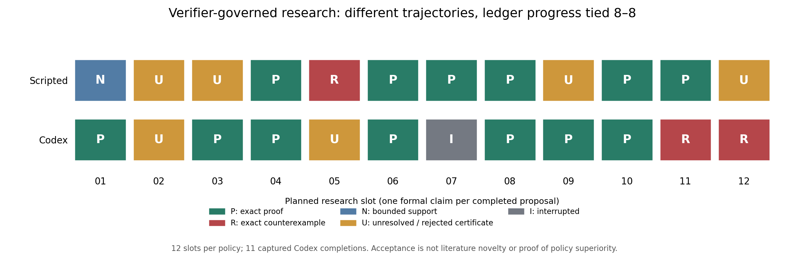

# Phase 5：受验证器约束的研究选题与迭代

完成日期：2026-10-05（Asia/Shanghai）。起点：`1440f9c`。

**已经实现并实际运行了 Codex 自主选题 → 形式化提案 → 确定性验证 → 失败反馈 → 下一研究动作的闭环。本轮尚未显示它比固定 workflow 产生更多有效研究推进：预定指标为 8 比 8。**

主实验每个策略安排 12 个槽位。Codex 有 **11 份带真实 CLI 完成回执的提案**；第七槽位执行中断，保留为失败，不重试、不补造。Scripted baseline 完成 12 个固定动作。本文不把这描述为连续成功运行的十二次模型推理。

最终统计入口：[统一重评分对照](comparison-v3-001/comparison.json)。数学验收入口：[Codex 审计](paired-v2-codex-001/audit.json)、[baseline 审计](paired-v2-scripted-001/audit.json)、[续跑完整性](paired-v2-codex-001/RESUME_AUDIT.json)。

## Agent 实际选择了什么

起始状态只提供已有结论、失败、四个 frontier 和允许的数学工具，没有将 baseline 的轮次表送给 Codex。模型自己选择了一个方向：**从 lifted 稳定性不等式，逐步走向 sensing-vector uncertainty 的充分界与反例**。它没有继续优化 CEP90，也没有引入第三个逆问题。

以下“问题”是提案的研究含义；自动验证的权威对象始终是保存的形式化多项式及约束，而非自然语言解释。

| 槽位 | 模型选择的研究动作 | verifier 结果 |
|---|---|---|
| 01 | 在符号对齐、总能量下限条件下证明 rank-one lifting 的距离下界 | **proved-in-project**：精确 SOS 恒等式通过 |
| 02 | 将下界写成一个四向量测量设计的不等式 | **unresolved**：SOS 恒等式不成立，未获批准 |
| 03 | 根据第二轮错误修改形式化多项式展开 | **proved-in-project**：修正后的证书通过 |
| 04 | 删除一个测量向量，研究剩余三输出的充分下界 | **proved-in-project**：形式化的 `1/3` 下界通过 |
| 05 | 在第三输出存在相对扰动时保留 `1/12` 下界 | **unresolved**：提交的 SOS 证书不成立 |
| 06 | 保持第五轮形式命题，修正证明证书 | **proved-in-project**：修正后的 SOS 通过 |
| 07 | 执行进程中断，只有输入文件，无完成回执 | **unresolved**：运行失败；推理成本未知 |
| 08 | 将第六轮允许的平方误差扩大六倍 | **proved-in-project**：所提交不等式通过 |
| 09 | 将 `(1,1)` 的 sensing vector 扰动写成 `(1,1+h)`，研究 `|h|≤1/6` 的误差界 | **proved-in-project**：形式化证书通过；未提供非空域见证，按预定规则不计 productive step |
| 10 | 直接证明扰动后的三输出 lifted map 在 `|h|≤1/6` 上保持 `1/12` 下界 | **proved-in-project**：精确证书通过 |
| 11 | 尝试把允许范围扩大到 `|h|≤3/4` | **refuted**：找到满足约束的精确负值 |
| 12 | 将范围缩小为 `|h|≤5/7`，尝试修复第十一轮猜想 | **refuted**：修复仍然失败，保留第二个反例 |

完整输入、模型原始事件、proposal、工具证据和判定见 [逐轮记录](paired-v2-codex-001/scientific/iterations/)，简表见 [trajectory.csv](trajectory.csv)。r02→r03 和 r05→r06 是对拒绝反馈的两次后续修正；r11→r12 是一次**失败的猜想修复**。没有把失败修复包装成成功。

两个反例针对形式化命题

\[
p(a,b,c,h)=a^2+b^2+[a+(1+h)^2b+2(1+h)c]^2
-\frac{a^2+b^2+2c^2}{12}\ge0.
\]

- r11：`(a,b,c,h)=(-1/4,0,1,-3/4)`，精确得到 `p=-3/64`。
- r12：`(a,b,c,h)=(-2/7,0,1,-5/7)`，精确得到 `p=-1/98`。

这些是 **refuted** 的有理见证，不依赖浮点误差。不能据此声称整个定位系统失败，或把该充分下界的失败等同于实际不可恢复。一般 PR continuous cost gap、一般 quotient witness 定理和 continuous minimax completeness 仍未解决。

## 和固定 workflow 的对照

两者起始研究状态、原始数学源码、每轮工具上限和验证规则一致。每轮一个正式 claim，一次数学工具请求，上限 50,000 个预声明计费单元、60 秒；Codex 另有每次 180 秒的推理上限。所有失败计入分母。

Baseline 是预先固定的 frontier 覆盖策略，包含一次预定假设修复和一次连续成本下界回退，并非专门安排大量已知重复结论来让模型胜出。它不读取 Codex 的输出，也不根据反馈改变下一任务。

| 预定或更正后的指标 | Scripted | Codex |
|---|---:|---:|
| 计划槽位 | 12 | 12 |
| 完成的正式提案 | 12 | 11 |
| verifier 接受（含证明、证否、有限支持） | 8 / 12 | 9 / 12 |
| **非重复、非空泛的形式账本推进** | **8** | **8** |
| proved-in-project | 6 | 7 |
| refuted / 新反例 | 1 | 2 |
| numerically-supported | 1 | 0 |
| 拒绝或未解决（含运行失败） | 4 | 3 |
| 无效 envelope / 形式输入 | 0 | 0 |
| 被拒绝的证明证书 | 0 | 2 |
| 机器识别的已有结论重复 | 0 | 0 |
| 通过证明的形式命题修订（含表达式修正） | 2 | 1 |
| 已被证伪猜想的成功修复 | 1 | 0 |
| 拒绝证书后的成功修正 | 0 | 2 |
| 修订猜想再次被证伪 | 0 | 1 |
| 状态请求与授权结果不符的 overclaim | 0 | 0 |
| 已执行、获验收的共享 finite-minimax 调用 | 3（含 Range 与 PR） | 0 |

**numerically-supported：本轮 productive 指标持平。** Codex 自行形成了更集中的扰动界研究路线，并在收到具体证书错误后做了两次修正；但这不证明反馈的因果效果，也没有显示更广的研究覆盖或更高的总体科研价值。若要论证因果作用，还需反馈消融；本项目不在此追加新的研发阶段。

`productive` 是预定的形式化代理指标，不是“原创定理数”。r09 的 SOS 证明有效，但没有按评分规则提交可行域非空见证，因此不记推进；这不表示该域事实上为空。我们没有因对照结果而放宽这一规则。机器识别重复为零也不意味着文献中没有已有结果。

两种策略选择的问题难度与类型不同，只有一条轨迹，没有随机重复、置信区间或统计显著性结论。模型主要使用多项式工具，未主动调用本轮 Range/PR 共用 minimax 工具；跨问题机制继续由此前 v4 和本轮 baseline 的实际调用支持，不能归给 Codex 此次自主轨迹。

## 谁决定“证明成功”

**known：** 非负加权平方和、非负约束乘子以及逐系数恒等式检查，是这里采用的确定性充分证明规则。其他消费者复用冻结 v4 的独立半径与 Bellman 验证方法。

Codex 只能提交结构化数据。运行使用只读沙箱，禁用 shell/exec、插件、外部浏览、子代理和隐式项目文档输入；controller 保存输出，worker 独立重算，controller 才追加哈希链账本。源码、历史文件与已存在记录逐轮检查。两份错误证书被拒绝的实际记录说明该边界在本轮确实执行了。

**边界：** 这是有限形式语言下的验证系统，不是通用证明助理，也不是对恶意宿主的安全证明。自然语言问题是否被完整、正确地形式化，仍然不能仅靠当前内核保证。模型在 `interpretation` 中写出的物理解释不自动获得证明状态。测试通过也不等于已经形式证明整个软件永不出错。

文献有独立状态轴：`known / novelty-uncertain`。冻结查询表只返回事先审计过的命题；未匹配不会产生“原创”标签。本轮 Codex 没有自行完成新的开放网络文献搜索。参见 [补充文献边界](POST_RUN_LITERATURE_BOUNDARY.md)：rank-one lifting、度量区别及近原点退化属于已有研究框架，不能因这里生成了具体 SOS 证书就宣称新的 PR 理论。

## 实际成本、复现与保留的问题

主轨迹有 **11 份真实完成回执**。显式请求模型为官方 CLI 可用列表中的 `gpt-6.1-sol`，客户端版本 `0.160.0`。CLI 没有另外回传可核对的实际后端模型 ID，因此不捏造该字段。

- 已捕获 input tokens：**242,679**；output tokens：**14,885**；cached input：0。逐轮原始 usage 字段仍在 runtime/event 文件中。
- 已捕获提案调用时间合计约 **594.77 秒**。第七轮用量和时长未知，故以上是实际成本的下界，不是完整总成本。
- 数学内核记录时间：Codex 约 **0.0147 秒**，scripted 约 **0.5180 秒**；这不含进程启动、哈希检查、模型推理及复现审计，不能作为整体效率比较。
- 美元成本没有账单证据，记录为未知。中止的旧传输试跑另有两份完成回执和失败/中断，单独列于 [provider_costs.csv](provider_costs.csv)，未藏入主实验或算成新研究。

保留了三类工程事实：

1. [Issue 001](EVALUATOR_ISSUE_001.md)：旧 transport 将 CLI 启动提示误判为工具使用。旧记录保留，新增 v2，两个策略同版重跑。
2. [执行中断](EXECUTION_INTERRUPTION_001.md)：第七槽位中断。独立复核前六轮后按既定失败规则继续，不重试该槽位；此前 **68 个已存在产物保持原字节**。
3. [Issue 002](EVALUATOR_ISSUE_002.md)：原统计把再次证否当作成功修复。独立 v3 报告消费者在同一冻结轨迹上对两个策略统一重评分；原始记录不变，数学状态不变，无新模型调用。

验收证据：

- [220 项全项目回归测试通过](final_test_verification.json)，另有 [1 项中断续跑测试](operations-resume-tests.xml) 和 [3 项统计更正测试](metric-v3-tests.xml)。
- 两条 12 槽位记录均通过完整数学重放、状态/提示词重建、原始 CLI 回执绑定和账本重建；[统一复现审计](comparison-v3-001/replay_audits.json)。中断槽位按明确的失败回执重放，未生成模型输出。
- v1–v4 的 **4,083 个已跟踪文件逐字节未变**。原 scripted 与 transport v2 重跑的账本完全相同；[回归记录](scripted_transport_regression.json)。
- 重放固定已记录的实际模型输出；不声称重新调用随机模型会逐字节生成相同提案。

## 课程项目可以据此主张什么

**numerically-supported：** 在人提供的 frontier、形式语言和工具边界内，真实 Codex 可以自行选取一条研究路线，提交可检验命题，面对拒绝证书和反例继续修正或缩小问题；接受权始终在确定性消费者一侧。

**尚未支持：** 比 scripted workflow 更高的总体科研产出、独立确认文献新颖性、普适自主数学发现、或解决一般非线性逆问题。最值得展示的是这条包含失败的实际轨迹及其治理机制，而非把九次验收写成九项原创发现。

Phase 5 到此收束。后续应整理课程报告与答辩材料，将这条真实研究轨迹作为叙述主线；本轮没有新开 v6/v7。
